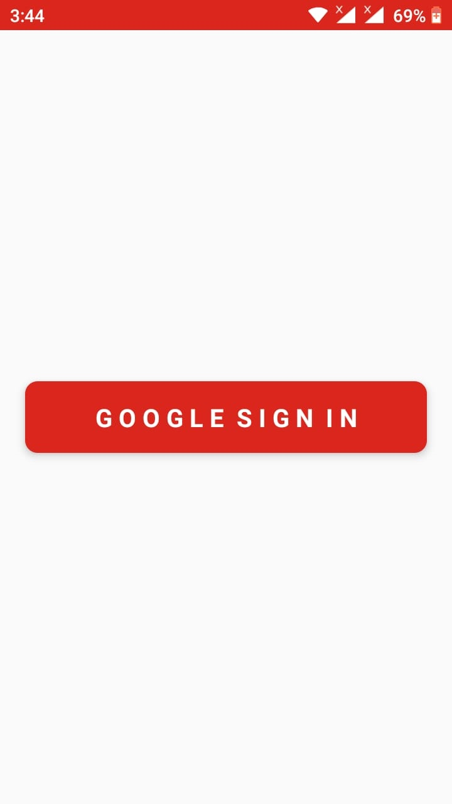
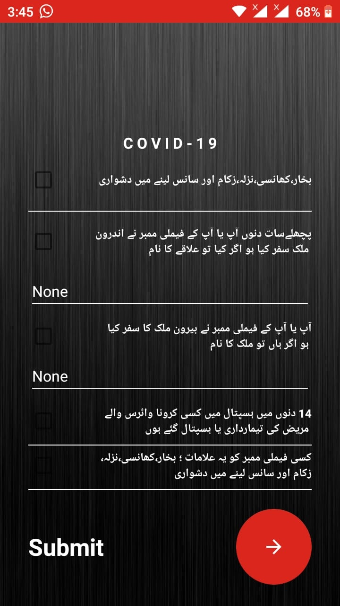
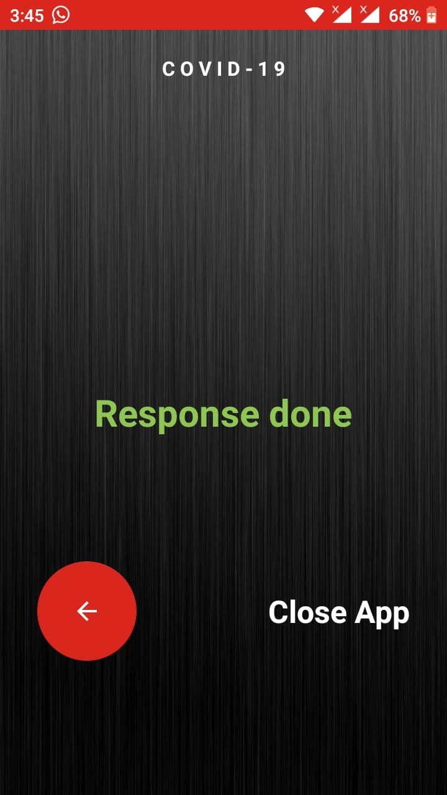
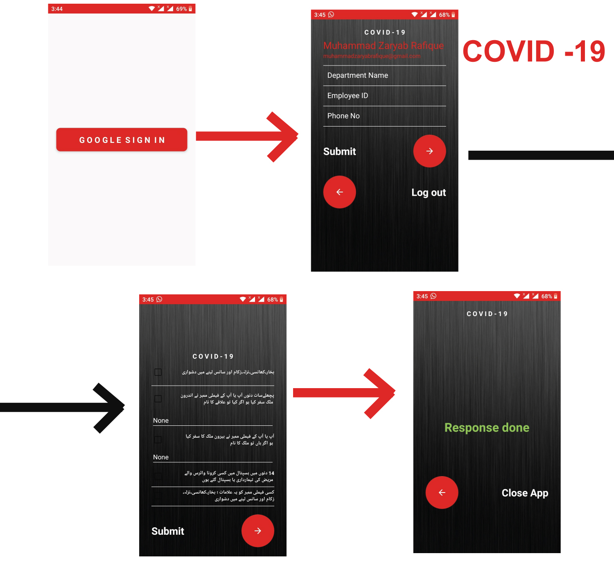

#### COVID-19-APP. CORONA VIRUS App for Employees. Collecting 15 Days Data from Employees and Company will get results.

### Google Sigin Method Use

# Displaying Data From Google And Taking It From User And Storing It To Realtime Database (Firebase)

# Asking Question From Employee Of The Company and Apply Action On that. Question Language According To Company Demand

 
# Response Submitted

# Flow Of App Activities & Working

